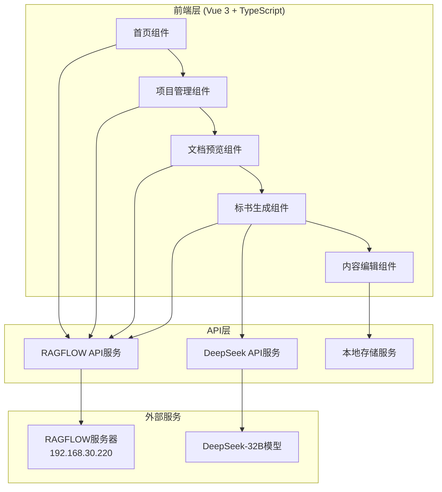

# 招标文件智能生成标书系统设计文档

## 概述

本系统基于现有的mineru-web前端架构，集成RAGFLOW文档解析服务和deepseek-32B大模型，为用户提供智能化的标书生成服务。系统采用Vue 3 + TypeScript + Element Plus技术栈，通过RESTful API与RAGFLOW服务器通信，实现文档上传、解析、知识库检索和智能内容生成功能。

## 架构设计

### 系统架构图



### 技术栈

- **前端框架**: Vue 3 + TypeScript
- **UI组件库**: Element Plus
- **状态管理**: Pinia
- **路由管理**: Vue Router
- **HTTP客户端**: Axios
- **文档处理**: mammoth (Word), docx (Word生成)
- **Markdown渲染**: markdown-it + katex

## 组件设计

### 1. 导航组件 (Navigation)

**功能**: 提供系统主导航，包含"首页"和"项目"两个主要入口

**接口**:
```typescript
interface NavigationProps {
  currentRoute: string
}

interface NavigationEmits {
  navigate: (route: string) => void
}
```

### 2. 首页组件 (Home)

**功能**: 显示系统介绍和快速上传入口

**状态管理**:
```typescript
interface HomeState {
  systemInfo: {
    title: string
    description: string
    features: string[]
  }
}
```

### 3. 项目管理组件 (ProjectManager)

**功能**: 管理用户上传的招标文件，支持卡片和列表两种展示模式

**状态管理**:
```typescript
interface ProjectState {
  projects: TenderProject[]
  viewMode: 'card' | 'list'
  loading: boolean
  pagination: {
    page: number
    pageSize: number
    total: number
  }
}

interface TenderProject {
  id: string
  name: string
  fileName: string
  uploadTime: string
  status: 'uploading' | 'parsing' | 'ready' | 'error'
  datasetId?: string
  documentId?: string
}
```

### 4. 文档上传组件 (DocumentUpload)

**功能**: 处理文件上传到RAGFLOW服务器

**API集成**:
```typescript
class RAGFlowService {
  async createDataset(name: string): Promise<Dataset>
  async uploadDocument(datasetId: string, file: File): Promise<Document>
  async parseDocument(datasetId: string, documentIds: string[]): Promise<void>
  async retrieveContent(datasetId: string, question: string): Promise<RetrievalResult>
}
```

### 5. 文档预览组件 (DocumentPreview)

**功能**: 左侧显示原文预览，右侧显示不同状态的内容

**状态管理**:
```typescript
interface PreviewState {
  currentProject: TenderProject
  originalContent: string
  rightPanelMode: 'settings' | 'outline' | 'content'
  settings: {
    length: 'short' | 'medium' | 'long'
    quality: 'expert' | 'standard'
  }
}
```

### 6. 大纲生成组件 (OutlineGenerator)

**功能**: 执行五阶段大纲生成流程

**状态管理**:
```typescript
interface OutlineState {
  currentStage: number
  stages: OutlineStage[]
  isGenerating: boolean
  finalOutline: string
}

interface OutlineStage {
  id: number
  title: string
  prompt: string
  result: string
  status: 'pending' | 'processing' | 'completed' | 'error'
}
```

### 7. 标书生成组件 (ProposalGenerator)

**功能**: 基于大纲生成详细标书内容

**API集成**:
```typescript
class DeepSeekService {
  async generateContent(outline: string, settings: GenerationSettings): Promise<string>
  private splitOutline(outline: string): string[]
  private generateChunk(chunk: string): Promise<string>
}
```

### 8. 内容编辑组件 (ContentEditor)

**功能**: 提供富文本编辑和保存功能

**状态管理**:
```typescript
interface EditorState {
  content: string
  isDirty: boolean
  autoSaveTimer: number | null
}
```

## 数据模型

### 1. 项目数据模型

```typescript
interface TenderProject {
  id: string
  name: string
  fileName: string
  fileSize: number
  uploadTime: string
  status: ProjectStatus
  datasetId?: string
  documentId?: string
  settings?: GenerationSettings
  outline?: string
  content?: string
  lastModified: string
}

type ProjectStatus = 'uploading' | 'parsing' | 'ready' | 'generating' | 'completed' | 'error'
```

### 2. 生成设置模型

```typescript
interface GenerationSettings {
  length: 'short' | 'medium' | 'long'
  quality: 'expert' | 'standard'
}
```

### 3. RAGFLOW API模型

```typescript
interface Dataset {
  id: string
  name: string
  chunk_method: string
  status: string
  create_time: number
}

interface Document {
  id: string
  name: string
  dataset_id: string
  size: number
  status: string
  chunk_count: number
}

interface RetrievalResult {
  chunks: Chunk[]
  total: number
}

interface Chunk {
  content: string
  similarity: number
  document_id: string
}
```

## 接口设计

### 1. RAGFLOW API集成

**基础配置**:
```typescript
const RAGFLOW_CONFIG = {
  baseURL: 'http://192.168.30.220',
  apiKey: 'ragflow-FmYTZmNmYyMDNmYzExZjA4OGFjZGU3Nm',
  timeout: 30000
}
```

**主要接口**:

1. **创建数据集**
   - `POST /api/v1/datasets`
   - 参数: `{ name, chunk_method: 'book' }`

2. **上传文档**
   - `POST /api/v1/datasets/{dataset_id}/documents`
   - 参数: FormData with file

3. **解析文档**
   - `POST /api/v1/datasets/{dataset_id}/chunks`
   - 参数: `{ document_ids: [string] }`

4. **检索内容**
   - `POST /api/v1/retrieval`
   - 参数: `{ question, dataset_ids, similarity_threshold: 0.2 }`

### 2. DeepSeek API集成

**配置**:
```typescript
const DEEPSEEK_CONFIG = {
  model: 'deepseek-32b',
  maxTokens: 4096,
  temperature: 0.7
}
```

**接口**:
```typescript
interface DeepSeekRequest {
  model: string
  messages: ChatMessage[]
  max_tokens: number
  temperature: number
}

interface ChatMessage {
  role: 'system' | 'user' | 'assistant'
  content: string
}
```

### 3. 本地存储接口

**项目数据存储**:
```typescript
class LocalStorageService {
  saveProject(project: TenderProject): void
  getProject(id: string): TenderProject | null
  getAllProjects(): TenderProject[]
  deleteProject(id: string): void
  updateProject(id: string, updates: Partial<TenderProject>): void
}
```

## 错误处理

### 1. API错误处理

```typescript
class APIErrorHandler {
  static handle(error: AxiosError): void {
    switch (error.response?.status) {
      case 401:
        ElMessage.error('API认证失败，请检查密钥配置')
        break
      case 404:
        ElMessage.error('请求的资源不存在')
        break
      case 500:
        ElMessage.error('服务器内部错误，请稍后重试')
        break
      default:
        ElMessage.error('网络请求失败，请检查网络连接')
    }
  }
}
```

### 2. 文件上传错误处理

```typescript
class UploadErrorHandler {
  static validateFile(file: File): boolean {
    const maxSize = 200 * 1024 * 1024 // 200MB
    const allowedTypes = ['.pdf', '.doc', '.docx']
    
    if (file.size > maxSize) {
      ElMessage.error('文件大小不能超过200MB')
      return false
    }
    
    const fileExt = file.name.toLowerCase().substring(file.name.lastIndexOf('.'))
    if (!allowedTypes.includes(fileExt)) {
      ElMessage.error('不支持的文件类型')
      return false
    }
    
    return true
  }
}
```

## 测试策略

### 1. 单元测试

- 组件逻辑测试
- API服务测试
- 工具函数测试

### 2. 集成测试

- RAGFLOW API集成测试
- DeepSeek API集成测试
- 端到端流程测试

### 3. 用户体验测试

- 文件上传流程测试
- 大纲生成流程测试
- 内容编辑功能测试

## 性能优化

### 1. 前端优化

- 组件懒加载
- 虚拟滚动（大量项目列表）
- 图片懒加载
- 防抖处理（搜索、自动保存）

### 2. API优化

- 请求缓存
- 并发控制
- 超时处理
- 重试机制

### 3. 内容生成优化

- 分段生成（避免token限制）
- 流式输出（实时显示生成进度）
- 缓存机制（避免重复生成）

## 安全考虑

### 1. API安全

- API密钥安全存储
- 请求签名验证
- 跨域请求控制

### 2. 数据安全

- 敏感信息加密存储
- 用户数据隔离
- 文件上传安全检查

### 3. 前端安全

- XSS防护
- CSRF防护
- 输入验证和清理