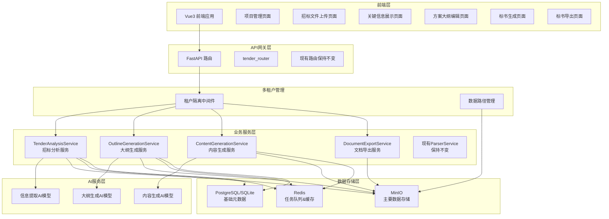
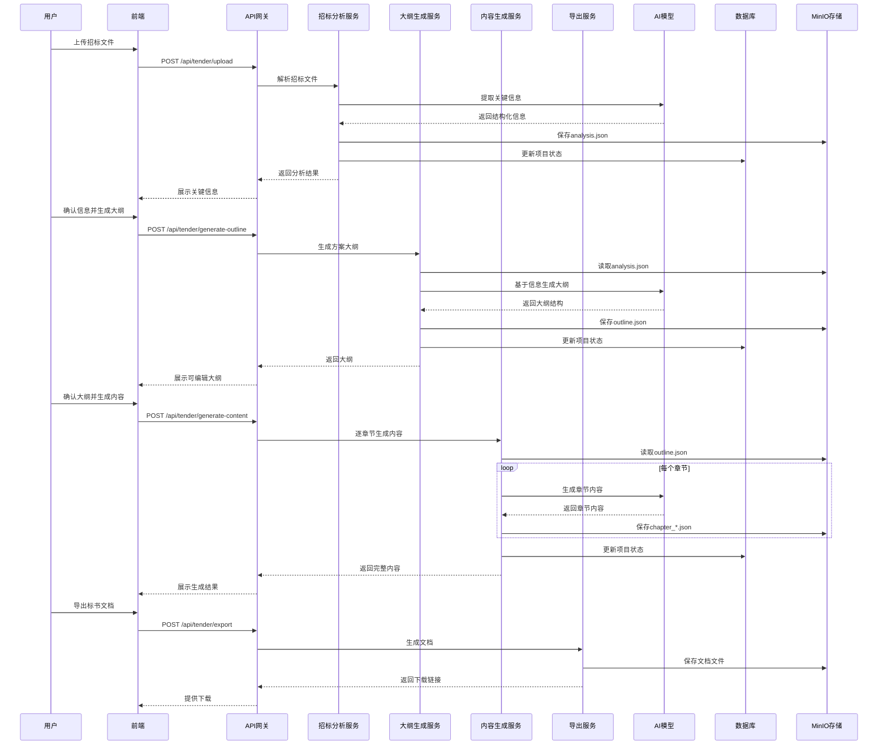

·# 招标文件智能生成标书系统设计文档

## 概述

本设计文档描述了在现有mineru-web系统基础上扩展的招标文件智能生成标书系统。系统将复用现有的文件上传、解析和存储基础设施，新增招标文件关键信息提取、方案大纲生成、AI全文撰写和标书导出功能。

### 核心设计原则
- 最大化复用现有系统架构和组件
- 保持与现有功能的兼容性
- 采用微服务架构，确保模块间低耦合
- 支持异步处理，提升用户体验
- 多租户架构，确保数据安全和租户隔离
- 以MinIO为主要存储，减少数据库依赖

## 架构设计

### 系统架构图



### 数据流架构



## 前端界面设计

### 导航菜单扩展

在现有的左侧导航栏中新增"项目"菜单项，更新后的导航结构：

```javascript
const menuItems = [
  { icon: HomeFilled, path: '/', tooltip: '首页' },
  { icon: Document, path: '/files', tooltip: '文件管理' },
  { icon: FolderOpened, path: '/projects', tooltip: '项目管理' }, // 新增
  { icon: Upload, path: '/upload', tooltip: '上传' }
]
```

### 项目管理页面设计

#### 页面布局
项目管理页面采用与现有文件管理页面一致的设计风格：

```vue
<template>
  <div class="projects-container">
    <!-- 页面头部 -->
    <div class="page-header">
      <div class="header-left">
        <h2 class="page-title">项目管理</h2>
        <span class="page-subtitle">管理您的招标项目</span>
      </div>
      <div class="header-right">
        <el-button type="primary" @click="createProject">
          <el-icon><Plus /></el-icon>
          新建项目
        </el-button>
      </div>
    </div>

    <!-- 搜索和筛选 -->
    <div class="filter-bar">
      <el-input
        v-model="searchQuery"
        placeholder="搜索项目名称"
        prefix-icon="Search"
        clearable
        class="search-input"
      />
      <el-select v-model="statusFilter" placeholder="项目状态" clearable>
        <el-option label="分析中" value="analyzing" />
        <el-option label="已分析" value="analyzed" />
        <el-option label="大纲生成中" value="outlining" />
        <el-option label="内容生成中" value="generating" />
        <el-option label="已完成" value="completed" />
      </el-select>
    </div>

    <!-- 项目列表 -->
    <div class="projects-grid">
      <div 
        v-for="project in projects" 
        :key="project.id" 
        class="project-card"
        @click="openProject(project.id)"
      >
        <div class="card-header">
          <div class="project-status">
            <el-tag :type="getStatusType(project.status)">
              {{ getStatusText(project.status) }}
            </el-tag>
          </div>
          <el-dropdown @command="handleCommand">
            <el-icon class="more-icon"><MoreFilled /></el-icon>
            <template #dropdown>
              <el-dropdown-menu>
                <el-dropdown-item command="edit">编辑</el-dropdown-item>
                <el-dropdown-item command="export">导出</el-dropdown-item>
                <el-dropdown-item command="delete" divided>删除</el-dropdown-item>
              </el-dropdown-menu>
            </template>
          </el-dropdown>
        </div>
        
        <div class="card-content">
          <h3 class="project-title">{{ project.project_name }}</h3>
          <p class="project-info">
            <el-icon><Document /></el-icon>
            基于文件：{{ project.source_filename }}
          </p>
          <div class="project-progress" v-if="project.progress">
            <el-progress 
              :percentage="project.progress" 
              :stroke-width="6"
              :show-text="false"
            />
            <span class="progress-text">{{ project.progress }}%</span>
          </div>
        </div>
        
        <div class="card-footer">
          <span class="create-time">
            {{ formatTime(project.created_at) }}
          </span>
          <div class="action-buttons">
            <el-button 
              v-if="project.status === 'completed'" 
              size="small" 
              type="success"
              @click.stop="downloadDocument(project.id)"
            >
              下载标书
            </el-button>
            <el-button 
              v-else 
              size="small" 
              type="primary"
              @click.stop="continueProject(project.id)"
            >
              继续编辑
            </el-button>
          </div>
        </div>
      </div>
    </div>

    <!-- 分页 -->
    <div class="pagination-wrapper">
      <el-pagination
        v-model:current-page="currentPage"
        v-model:page-size="pageSize"
        :page-sizes="[12, 24, 48]"
        :total="total"
        layout="total, sizes, prev, pager, next, jumper"
        @size-change="handleSizeChange"
        @current-change="handleCurrentChange"
      />
    </div>
  </div>
</template>
```

#### 样式设计
```scss
.projects-container {
  padding: 24px;
  background: #f7f8fa;
  min-height: 100vh;
}

.page-header {
  display: flex;
  justify-content: space-between;
  align-items: center;
  margin-bottom: 24px;
  
  .header-left {
    .page-title {
      font-size: 24px;
      font-weight: 600;
      color: #1f2937;
      margin: 0 0 4px 0;
    }
    
    .page-subtitle {
      color: #6b7280;
      font-size: 14px;
    }
  }
}

.filter-bar {
  display: flex;
  gap: 16px;
  margin-bottom: 24px;
  
  .search-input {
    width: 300px;
  }
}

.projects-grid {
  display: grid;
  grid-template-columns: repeat(auto-fill, minmax(320px, 1fr));
  gap: 20px;
  margin-bottom: 32px;
}

.project-card {
  background: white;
  border-radius: 12px;
  padding: 20px;
  box-shadow: 0 2px 8px rgba(0, 0, 0, 0.04);
  border: 1px solid #e5e7eb;
  cursor: pointer;
  transition: all 0.2s ease;
  
  &:hover {
    box-shadow: 0 4px 16px rgba(0, 0, 0, 0.08);
    transform: translateY(-2px);
  }
  
  .card-header {
    display: flex;
    justify-content: space-between;
    align-items: center;
    margin-bottom: 16px;
    
    .more-icon {
      color: #9ca3af;
      cursor: pointer;
      
      &:hover {
        color: #6b7280;
      }
    }
  }
  
  .card-content {
    .project-title {
      font-size: 16px;
      font-weight: 600;
      color: #1f2937;
      margin: 0 0 8px 0;
      line-height: 1.4;
    }
    
    .project-info {
      display: flex;
      align-items: center;
      gap: 6px;
      color: #6b7280;
      font-size: 14px;
      margin-bottom: 12px;
    }
    
    .project-progress {
      display: flex;
      align-items: center;
      gap: 8px;
      
      .progress-text {
        font-size: 12px;
        color: #6b7280;
        min-width: 32px;
      }
    }
  }
  
  .card-footer {
    display: flex;
    justify-content: space-between;
    align-items: center;
    margin-top: 16px;
    padding-top: 16px;
    border-top: 1px solid #f3f4f6;
    
    .create-time {
      font-size: 12px;
      color: #9ca3af;
    }
  }
}
```

### 项目详情页面设计

项目详情页面采用步骤式布局，展示项目的完整工作流：

```vue
<template>
  <div class="project-detail">
    <!-- 步骤导航 -->
    <div class="steps-container">
      <el-steps :active="currentStep" align-center>
        <el-step title="文件分析" description="提取关键信息" />
        <el-step title="大纲生成" description="生成方案框架" />
        <el-step title="内容生成" description="AI撰写内容" />
        <el-step title="文档导出" description="生成最终标书" />
      </el-steps>
    </div>

    <!-- 步骤内容 -->
    <div class="step-content">
      <!-- 根据currentStep显示不同的组件 -->
      <AnalysisStep v-if="currentStep === 0" :project="project" />
      <OutlineStep v-else-if="currentStep === 1" :project="project" />
      <ContentStep v-else-if="currentStep === 2" :project="project" />
      <ExportStep v-else-if="currentStep === 3" :project="project" />
    </div>
  </div>
</template>
```

### 新建项目对话框

```vue
<template>
  <el-dialog v-model="visible" title="新建招标项目" width="500px">
    <el-form :model="form" :rules="rules" ref="formRef" label-width="100px">
      <el-form-item label="项目名称" prop="project_name">
        <el-input v-model="form.project_name" placeholder="请输入项目名称" />
      </el-form-item>
      
      <el-form-item label="招标文件" prop="source_file_id">
        <el-select 
          v-model="form.source_file_id" 
          placeholder="选择已上传的招标文件"
          filterable
        >
          <el-option
            v-for="file in availableFiles"
            :key="file.id"
            :label="file.filename"
            :value="file.id"
          />
        </el-select>
        <div class="form-tip">
          如果没有找到文件，请先到 
          <router-link to="/upload">文件上传</router-link> 
          页面上传招标文件
        </div>
      </el-form-item>
    </el-form>
    
    <template #footer>
      <el-button @click="visible = false">取消</el-button>
      <el-button type="primary" @click="createProject" :loading="loading">
        创建项目
      </el-button>
    </template>
  </el-dialog>
</template>
```

## 组件和接口设计

### 多租户架构设计

#### 租户隔离策略
```python
class TenantManager:
    """多租户管理器"""
    
    @staticmethod
    def get_tenant_path(tenant_id: str, resource_type: str) -> str:
        """生成租户专用的存储路径"""
        return f"tenants/{tenant_id}/{resource_type}"
    
    @staticmethod
    def validate_tenant_access(user_id: str, resource_path: str) -> bool:
        """验证用户对资源的访问权限"""
        tenant_id = extract_tenant_from_user(user_id)
        return resource_path.startswith(f"tenants/{tenant_id}/")
```

#### 租户中间件
```python
class TenantMiddleware:
    """租户隔离中间件"""
    
    async def __call__(self, request: Request, call_next):
        # 从请求中提取租户信息
        tenant_id = self.extract_tenant_id(request)
        request.state.tenant_id = tenant_id
        
        # 设置租户上下文
        with tenant_context(tenant_id):
            response = await call_next(request)
        
        return response
```

### 存储架构重新设计

#### MinIO存储结构
```
mineru-bucket/
├── tenants/
│   ├── {tenant_id}/
│   │   ├── projects/
│   │   │   ├── {project_id}/
│   │   │   │   ├── metadata.json          # 项目基本信息
│   │   │   │   ├── analysis.json          # 分析结果
│   │   │   │   ├── outline.json           # 大纲结构
│   │   │   │   ├── content/
│   │   │   │   │   ├── chapter_1.json     # 章节内容
│   │   │   │   │   ├── chapter_2.json
│   │   │   │   │   └── ...
│   │   │   │   └── documents/
│   │   │   │       ├── final.pdf          # 最终文档
│   │   │   │       └── final.docx
│   │   │   └── ...
│   │   └── files/                         # 原始上传文件
│   └── ...
└── shared/                                # 共享资源（模板等）
    ├── templates/
    └── assets/
```

### 简化的数据模型

#### 1. TenderProject (招标项目 - 仅元数据)
```python
class TenderProject(Base):
    __tablename__ = 'tender_projects'
    
    id = Column(String(36), primary_key=True, default=lambda: str(uuid.uuid4()))
    tenant_id = Column(String(64), nullable=False, index=True)
    user_id = Column(String(64), nullable=False, index=True)
    project_name = Column(String(256), nullable=False)
    source_file_id = Column(Integer, ForeignKey('files.id'), nullable=False)
    status = Column(Enum(TenderStatus), default=TenderStatus.ANALYZING)
    minio_path = Column(String(512), nullable=False)  # MinIO中的项目路径
    created_at = Column(DateTime, default=datetime.utcnow)
    updated_at = Column(DateTime, onupdate=datetime.utcnow)
    
    def get_storage_path(self) -> str:
        """获取项目在MinIO中的存储路径"""
        return f"tenants/{self.tenant_id}/projects/{self.id}"
```

#### 2. TenderStatus (项目状态枚举)
```python
class TenderStatus(enum.Enum):
    ANALYZING = 'analyzing'          # 分析中
    ANALYZED = 'analyzed'            # 已分析
    OUTLINING = 'outlining'          # 大纲生成中
    OUTLINED = 'outlined'            # 大纲已生成
    GENERATING = 'generating'        # 内容生成中
    GENERATED = 'generated'          # 内容已生成
    EXPORTING = 'exporting'          # 导出中
    COMPLETED = 'completed'          # 已完成
    FAILED = 'failed'                # 失败
```

#### 3. MinIO数据结构定义
```python
# 项目元数据结构 (metadata.json)
class ProjectMetadata(BaseModel):
    project_id: str
    project_name: str
    tenant_id: str
    user_id: str
    source_file_id: int
    status: TenderStatus
    created_at: datetime
    updated_at: datetime
    progress: int = 0

# 分析结果结构 (analysis.json)
class AnalysisResult(BaseModel):
    project_info: Dict[str, Any]
    technical_requirements: Dict[str, Any]
    evaluation_criteria: Dict[str, Any]
    submission_requirements: Dict[str, Any]
    extracted_at: datetime

# 大纲结构 (outline.json)
class OutlineStructure(BaseModel):
    chapters: List[Dict[str, Any]]
    chapter_count: int
    generated_at: datetime
    
# 章节内容结构 (chapter_*.json)
class ChapterContent(BaseModel):
    chapter_id: str
    chapter_title: str
    content: str
    word_count: int
    generated_at: datetime
```

### API接口设计

#### 1. 招标项目管理接口

```python
# 创建招标项目
POST /api/tender/projects
{
    "project_name": "某某系统建设项目",
    "source_file_id": 123
}

# 获取项目列表
GET /api/tender/projects?page=1&page_size=20

# 获取项目详情
GET /api/tender/projects/{project_id}

# 删除项目
DELETE /api/tender/projects/{project_id}
```

#### 2. 招标分析接口

```python
# 开始分析招标文件
POST /api/tender/projects/{project_id}/analyze
{
    "force_reanalyze": false
}

# 获取分析结果
GET /api/tender/projects/{project_id}/analysis

# 更新分析结果
PUT /api/tender/projects/{project_id}/analysis
{
    "project_info": {...},
    "technical_requirements": {...},
    "evaluation_criteria": {...}
}
```

#### 3. 大纲生成接口

```python
# 生成方案大纲
POST /api/tender/projects/{project_id}/outline/generate

# 获取大纲
GET /api/tender/projects/{project_id}/outline

# 更新大纲
PUT /api/tender/projects/{project_id}/outline
{
    "outline_structure": [...]
}
```

#### 4. 内容生成接口

```python
# 生成全部内容
POST /api/tender/projects/{project_id}/content/generate-all

# 生成单个章节
POST /api/tender/projects/{project_id}/content/generate-chapter
{
    "chapter_id": "1.1"
}

# 获取内容
GET /api/tender/projects/{project_id}/content

# 更新章节内容
PUT /api/tender/projects/{project_id}/content/{chapter_id}
{
    "content": "更新后的内容"
}
```

#### 5. 文档导出接口

```python
# 导出标书文档
POST /api/tender/projects/{project_id}/export
{
    "format": "pdf",  # pdf, docx
    "template": "standard"
}

# 获取导出历史
GET /api/tender/projects/{project_id}/documents

# 下载文档
GET /api/tender/documents/{document_id}/download
```

### 服务组件设计

#### 0. TenderStorageService (招标存储服务)

```python
class TenderStorageService:
    """基于MinIO的招标项目存储服务"""
    
    def __init__(self, minio_client: MinioClient, bucket_name: str):
        self.minio_client = minio_client
        self.bucket_name = bucket_name
    
    def get_project_path(self, tenant_id: str, project_id: str) -> str:
        """获取项目存储路径"""
        return f"tenants/{tenant_id}/projects/{project_id}"
    
    async def save_project_metadata(self, project: TenderProject, metadata: ProjectMetadata):
        """保存项目元数据"""
        path = f"{project.get_storage_path()}/metadata.json"
        await self._save_json(path, metadata.dict())
    
    async def load_project_metadata(self, project: TenderProject) -> ProjectMetadata:
        """加载项目元数据"""
        path = f"{project.get_storage_path()}/metadata.json"
        data = await self._load_json(path)
        return ProjectMetadata(**data)
    
    async def save_analysis_result(self, project: TenderProject, analysis: AnalysisResult):
        """保存分析结果"""
        path = f"{project.get_storage_path()}/analysis.json"
        await self._save_json(path, analysis.dict())
    
    async def load_analysis_result(self, project: TenderProject) -> AnalysisResult:
        """加载分析结果"""
        path = f"{project.get_storage_path()}/analysis.json"
        data = await self._load_json(path)
        return AnalysisResult(**data)
    
    async def save_outline(self, project: TenderProject, outline: OutlineStructure):
        """保存大纲结构"""
        path = f"{project.get_storage_path()}/outline.json"
        await self._save_json(path, outline.dict())
    
    async def load_outline(self, project: TenderProject) -> OutlineStructure:
        """加载大纲结构"""
        path = f"{project.get_storage_path()}/outline.json"
        data = await self._load_json(path)
        return OutlineStructure(**data)
    
    async def save_chapter_content(self, project: TenderProject, chapter: ChapterContent):
        """保存章节内容"""
        path = f"{project.get_storage_path()}/content/chapter_{chapter.chapter_id}.json"
        await self._save_json(path, chapter.dict())
    
    async def load_chapter_content(self, project: TenderProject, chapter_id: str) -> ChapterContent:
        """加载章节内容"""
        path = f"{project.get_storage_path()}/content/chapter_{chapter_id}.json"
        data = await self._load_json(path)
        return ChapterContent(**data)
    
    async def load_all_chapters(self, project: TenderProject) -> List[ChapterContent]:
        """加载所有章节内容"""
        content_path = f"{project.get_storage_path()}/content/"
        objects = self.minio_client.list_objects(self.bucket_name, prefix=content_path)
        chapters = []
        for obj in objects:
            if obj.object_name.endswith('.json'):
                data = await self._load_json(obj.object_name)
                chapters.append(ChapterContent(**data))
        return sorted(chapters, key=lambda x: x.chapter_id)
    
    async def save_document(self, project: TenderProject, document_type: str, content: bytes) -> str:
        """保存生成的文档"""
        filename = f"final.{document_type.lower()}"
        path = f"{project.get_storage_path()}/documents/{filename}"
        
        self.minio_client.put_object(
            self.bucket_name,
            path,
            io.BytesIO(content),
            len(content)
        )
        return path
    
    async def _save_json(self, path: str, data: dict):
        """保存JSON数据到MinIO"""
        json_str = json.dumps(data, ensure_ascii=False, indent=2)
        json_bytes = json_str.encode('utf-8')
        
        self.minio_client.put_object(
            self.bucket_name,
            path,
            io.BytesIO(json_bytes),
            len(json_bytes),
            content_type='application/json'
        )
    
    async def _load_json(self, path: str) -> dict:
        """从MinIO加载JSON数据"""
        try:
            response = self.minio_client.get_object(self.bucket_name, path)
            content = response.read().decode('utf-8')
            return json.loads(content)
        except Exception as e:
            raise FileNotFoundError(f"无法加载文件 {path}: {str(e)}")
```

#### 1. TenderAnalysisService (招标分析服务)

```python
class TenderAnalysisService:
    def __init__(self, db: Session, ai_client: AIClient, storage: TenderStorageService):
        self.db = db
        self.ai_client = ai_client
        self.storage = storage
    
    async def analyze_tender_document(self, project_id: str) -> AnalysisResult:
        """分析招标文件，提取关键信息"""
        project = self.db.query(TenderProject).filter(TenderProject.id == project_id).first()
        if not project:
            raise ValueError(f"项目 {project_id} 不存在")
        
        # 获取原始文件内容
        source_file = self.db.query(FileModel).filter(FileModel.id == project.source_file_id).first()
        parsed_content = self.db.query(ParsedContent).filter(
            ParsedContent.file_id == source_file.id
        ).first()
        
        if not parsed_content:
            raise ValueError("招标文件尚未解析，请先解析文件")
        
        # 使用AI提取关键信息
        project_info = await self.extract_project_info(parsed_content.content)
        technical_requirements = await self.extract_technical_requirements(parsed_content.content)
        evaluation_criteria = await self.extract_evaluation_criteria(parsed_content.content)
        submission_requirements = await self.extract_submission_requirements(parsed_content.content)
        
        # 创建分析结果
        analysis = AnalysisResult(
            project_info=project_info,
            technical_requirements=technical_requirements,
            evaluation_criteria=evaluation_criteria,
            submission_requirements=submission_requirements,
            extracted_at=datetime.utcnow()
        )
        
        # 保存到MinIO
        await self.storage.save_analysis_result(project, analysis)
        
        # 更新项目状态
        project.status = TenderStatus.ANALYZED
        self.db.commit()
        
        return analysis
        
    async def extract_project_info(self, content: str) -> Dict:
        """提取项目基本信息"""
        prompt = f"""
        请从以下招标文件中提取项目基本信息，以JSON格式返回：
        
        需要提取的信息包括：
        - project_name: 项目名称
        - budget: 项目预算
        - duration: 项目工期
        - location: 项目地点
        - contact_info: 联系方式
        - deadline: 投标截止时间
        
        招标文件内容：
        {content[:4000]}  # 限制长度避免token超限
        """
        
        response = await self.ai_client.generate(prompt)
        return json.loads(response)
        
    async def extract_technical_requirements(self, content: str) -> Dict:
        """提取技术要求"""
        prompt = f"""
        请从以下招标文件中提取技术要求，以JSON格式返回：
        
        需要提取的信息包括：
        - functional_requirements: 功能性要求列表
        - performance_requirements: 性能要求
        - technical_specifications: 技术规格
        - compliance_standards: 合规标准
        
        招标文件内容：
        {content[:4000]}
        """
        
        response = await self.ai_client.generate(prompt)
        return json.loads(response)
        
    async def extract_evaluation_criteria(self, content: str) -> Dict:
        """提取评分标准"""
        prompt = f"""
        请从以下招标文件中提取评分标准，以JSON格式返回：
        
        需要提取的信息包括：
        - technical_score: 技术分权重和评分标准
        - commercial_score: 商务分权重和评分标准
        - qualification_requirements: 资质要求
        - evaluation_method: 评标方法
        
        招标文件内容：
        {content[:4000]}
        """
        
        response = await self.ai_client.generate(prompt)
        return json.loads(response)
    
    async def extract_submission_requirements(self, content: str) -> Dict:
        """提取提交要求"""
        prompt = f"""
        请从以下招标文件中提取投标文件提交要求，以JSON格式返回：
        
        需要提取的信息包括：
        - document_format: 文档格式要求
        - submission_method: 提交方式
        - required_documents: 必需文档清单
        - document_structure: 文档结构要求
        
        招标文件内容：
        {content[:4000]}
        """
        
        response = await self.ai_client.generate(prompt)
        return json.loads(response)
```

#### 2. OutlineGenerationService (大纲生成服务)

```python
class OutlineGenerationService:
    def __init__(self, db: Session, ai_client: AIClient, storage: TenderStorageService):
        self.db = db
        self.ai_client = ai_client
        self.storage = storage
    
    async def generate_outline(self, project_id: str) -> OutlineStructure:
        """基于分析结果生成方案大纲"""
        project = self.db.query(TenderProject).filter(TenderProject.id == project_id).first()
        if not project:
            raise ValueError(f"项目 {project_id} 不存在")
        
        # 加载分析结果
        analysis = await self.storage.load_analysis_result(project)
        
        # 使用AI生成大纲
        prompt = f"""
        基于以下招标分析结果，生成标书大纲结构，以JSON格式返回：
        
        项目信息：{json.dumps(analysis.project_info, ensure_ascii=False)}
        技术要求：{json.dumps(analysis.technical_requirements, ensure_ascii=False)}
        评分标准：{json.dumps(analysis.evaluation_criteria, ensure_ascii=False)}
        
        请生成包含以下结构的大纲：
        {{
            "chapters": [
                {{
                    "chapter_id": "1",
                    "title": "项目理解",
                    "description": "章节描述",
                    "subsections": [
                        {{"id": "1.1", "title": "项目背景分析"}},
                        {{"id": "1.2", "title": "需求理解"}}
                    ]
                }},
                // 更多章节...
            ]
        }}
        """
        
        response = await self.ai_client.generate(prompt)
        outline_data = json.loads(response)
        
        outline = OutlineStructure(
            chapters=outline_data["chapters"],
            chapter_count=len(outline_data["chapters"]),
            generated_at=datetime.utcnow()
        )
        
        # 保存到MinIO
        await self.storage.save_outline(project, outline)
        
        # 更新项目状态
        project.status = TenderStatus.OUTLINED
        self.db.commit()
        
        return outline
        
    async def customize_outline(self, project_id: str, user_input: Dict) -> OutlineStructure:
        """根据用户输入定制大纲"""
        project = self.db.query(TenderProject).filter(TenderProject.id == project_id).first()
        
        # 加载现有大纲
        current_outline = await self.storage.load_outline(project)
        
        # 应用用户修改
        updated_chapters = user_input.get("chapters", current_outline.chapters)
        
        outline = OutlineStructure(
            chapters=updated_chapters,
            chapter_count=len(updated_chapters),
            generated_at=datetime.utcnow()
        )
        
        # 保存更新后的大纲
        await self.storage.save_outline(project, outline)
        
        return outline
```

#### 3. ContentGenerationService (内容生成服务)

```python
class ContentGenerationService:
    def __init__(self, db: Session, ai_client: AIClient, storage: TenderStorageService):
        self.db = db
        self.ai_client = ai_client
        self.storage = storage
    
    async def generate_all_content(self, project_id: str) -> List[ChapterContent]:
        """生成所有章节内容"""
        project = self.db.query(TenderProject).filter(TenderProject.id == project_id).first()
        if not project:
            raise ValueError(f"项目 {project_id} 不存在")
        
        # 加载分析结果和大纲
        analysis = await self.storage.load_analysis_result(project)
        outline = await self.storage.load_outline(project)
        
        # 更新项目状态
        project.status = TenderStatus.GENERATING
        self.db.commit()
        
        chapters = []
        total_chapters = len(outline.chapters)
        
        for i, chapter_info in enumerate(outline.chapters):
            try:
                chapter_content = await self.generate_chapter_content(
                    project_id, chapter_info["chapter_id"], analysis, outline
                )
                chapters.append(chapter_content)
                
                # 更新进度
                progress = int((i + 1) / total_chapters * 100)
                await self._update_project_progress(project, progress)
                
            except Exception as e:
                logger.error(f"生成章节 {chapter_info['chapter_id']} 失败: {str(e)}")
                continue
        
        # 更新项目状态
        project.status = TenderStatus.GENERATED
        self.db.commit()
        
        return chapters
        
    async def generate_chapter_content(
        self, 
        project_id: str, 
        chapter_id: str,
        analysis: AnalysisResult = None,
        outline: OutlineStructure = None
    ) -> ChapterContent:
        """生成单个章节内容"""
        project = self.db.query(TenderProject).filter(TenderProject.id == project_id).first()
        
        if not analysis:
            analysis = await self.storage.load_analysis_result(project)
        if not outline:
            outline = await self.storage.load_outline(project)
        
        # 找到对应章节信息
        chapter_info = None
        for chapter in outline.chapters:
            if chapter["chapter_id"] == chapter_id:
                chapter_info = chapter
                break
        
        if not chapter_info:
            raise ValueError(f"章节 {chapter_id} 不存在")
        
        # 生成章节内容
        prompt = f"""
        基于以下信息，撰写标书章节内容：
        
        章节信息：
        - 章节ID: {chapter_info['chapter_id']}
        - 章节标题: {chapter_info['title']}
        - 章节描述: {chapter_info.get('description', '')}
        
        项目分析结果：
        {json.dumps(analysis.dict(), ensure_ascii=False, indent=2)}
        
        请撰写专业、详细的标书内容，字数控制在1000-2000字之间。
        内容应该：
        1. 紧密结合招标要求
        2. 体现技术实力和经验
        3. 突出竞争优势
        4. 语言专业规范
        """
        
        content = await self.ai_client.generate(prompt)
        
        chapter_content = ChapterContent(
            chapter_id=chapter_id,
            chapter_title=chapter_info['title'],
            content=content,
            word_count=len(content),
            generated_at=datetime.utcnow()
        )
        
        # 保存章节内容
        await self.storage.save_chapter_content(project, chapter_content)
        
        return chapter_content
        
    async def regenerate_chapter(self, project_id: str, chapter_id: str) -> ChapterContent:
        """重新生成章节内容"""
        return await self.generate_chapter_content(project_id, chapter_id)
    
    async def _update_project_progress(self, project: TenderProject, progress: int):
        """更新项目进度"""
        metadata = await self.storage.load_project_metadata(project)
        metadata.progress = progress
        await self.storage.save_project_metadata(project, metadata)
```

#### 4. DocumentExportService (文档导出服务)

```python
class DocumentExportService:
    def __init__(self, db: Session, storage: TenderStorageService):
        self.db = db
        self.storage = storage
    
    async def export_to_pdf(self, project_id: str) -> str:
        """导出为PDF格式"""
        project = self.db.query(TenderProject).filter(TenderProject.id == project_id).first()
        if not project:
            raise ValueError(f"项目 {project_id} 不存在")
        
        # 加载所有数据
        analysis = await self.storage.load_analysis_result(project)
        outline = await self.storage.load_outline(project)
        chapters = await self.storage.load_all_chapters(project)
        
        # 生成PDF内容
        pdf_content = await self._generate_pdf_content(analysis, outline, chapters)
        
        # 保存文档
        document_path = await self.storage.save_document(project, "PDF", pdf_content)
        
        # 更新项目状态
        project.status = TenderStatus.COMPLETED
        self.db.commit()
        
        return document_path
        
    async def export_to_docx(self, project_id: str) -> str:
        """导出为Word格式"""
        project = self.db.query(TenderProject).filter(TenderProject.id == project_id).first()
        if not project:
            raise ValueError(f"项目 {project_id} 不存在")
        
        # 加载所有数据
        analysis = await self.storage.load_analysis_result(project)
        outline = await self.storage.load_outline(project)
        chapters = await self.storage.load_all_chapters(project)
        
        # 生成Word内容
        docx_content = await self._generate_docx_content(analysis, outline, chapters)
        
        # 保存文档
        document_path = await self.storage.save_document(project, "DOCX", docx_content)
        
        # 更新项目状态
        project.status = TenderStatus.COMPLETED
        self.db.commit()
        
        return document_path
    
    def generate_download_url(self, project_id: str, document_type: str) -> str:
        """生成下载链接"""
        project = self.db.query(TenderProject).filter(TenderProject.id == project_id).first()
        document_path = f"{project.get_storage_path()}/documents/final.{document_type.lower()}"
        
        # 生成预签名URL，有效期1小时
        return self.storage.minio_client.presigned_get_object(
            self.storage.bucket_name,
            document_path,
            expires=timedelta(hours=1)
        )
    
    async def _generate_pdf_content(self, analysis, outline, chapters) -> bytes:
        """生成PDF内容"""
        # 使用ReportLab或类似库生成PDF
        # 这里是示例实现
        from reportlab.pdfgen import canvas
        from reportlab.lib.pagesizes import A4
        import io
        
        buffer = io.BytesIO()
        p = canvas.Canvas(buffer, pagesize=A4)
        
        # 添加标题
        p.drawString(100, 750, f"标书文档 - {analysis.project_info.get('project_name', '未知项目')}")
        
        y_position = 700
        for chapter in chapters:
            p.drawString(100, y_position, f"{chapter.chapter_id}. {chapter.chapter_title}")
            y_position -= 30
            
            # 简化的内容添加（实际实现需要处理换行、分页等）
            content_lines = chapter.content[:200] + "..." if len(chapter.content) > 200 else chapter.content
            p.drawString(120, y_position, content_lines)
            y_position -= 50
            
            if y_position < 100:  # 换页
                p.showPage()
                y_position = 750
        
        p.save()
        buffer.seek(0)
        return buffer.read()
    
    async def _generate_docx_content(self, analysis, outline, chapters) -> bytes:
        """生成Word内容"""
        # 使用python-docx生成Word文档
        from docx import Document
        import io
        
        doc = Document()
        
        # 添加标题
        title = doc.add_heading(f"标书文档 - {analysis.project_info.get('project_name', '未知项目')}", 0)
        
        # 添加章节内容
        for chapter in chapters:
            doc.add_heading(f"{chapter.chapter_id}. {chapter.chapter_title}", level=1)
            doc.add_paragraph(chapter.content)
        
        # 保存到字节流
        buffer = io.BytesIO()
        doc.save(buffer)
        buffer.seek(0)
        return buffer.read()
```

## 错误处理

### 错误类型定义

```python
class TenderError(Exception):
    """招标系统基础异常"""
    pass

class AnalysisError(TenderError):
    """分析阶段异常"""
    pass

class GenerationError(TenderError):
    """生成阶段异常"""
    pass

class ExportError(TenderError):
    """导出阶段异常"""
    pass

class AIServiceError(TenderError):
    """AI服务异常"""
    pass
```

### 错误处理策略

1. **分析阶段错误**
   - 文件格式不支持：返回明确错误信息
   - AI服务不可用：提供重试机制
   - 内容提取失败：允许手动补充信息

2. **生成阶段错误**
   - 单章节生成失败：不影响其他章节
   - AI服务超时：提供重试和降级方案
   - 内容质量不佳：支持重新生成

3. **导出阶段错误**
   - 模板加载失败：使用默认模板
   - 文件生成失败：提供详细错误信息
   - 存储失败：重试机制

## 测试策略

### 单元测试
- 各服务类的核心方法测试
- 数据模型的验证测试
- AI接口的模拟测试

### 集成测试
- API端点的完整流程测试
- 数据库操作的事务测试
- 文件存储的读写测试

### 端到端测试
- 完整的标书生成流程测试
- 用户界面的交互测试
- 性能和并发测试

### 测试数据
- 准备多种类型的招标文件样本
- 创建标准的测试用例集
- 建立自动化测试流水线

## 性能优化

### 缓存策略
- Redis缓存分析结果，避免重复分析
- 缓存AI模型响应，提升响应速度
- 前端缓存项目列表和常用数据

### 异步处理
- 使用Celery处理长时间运行的任务
- 实现WebSocket推送任务进度
- 支持任务取消和重试机制

### 资源管理
- AI模型的连接池管理
- 数据库连接的优化配置
- MinIO客户端的复用策略

## 安全考虑

### 数据安全
- 用户数据严格隔离
- 敏感信息加密存储
- 文件访问权限控制

### API安全
- 请求频率限制
- 输入参数验证
- SQL注入防护

### 文件安全
- 上传文件类型检查
- 文件大小限制
- 恶意文件扫描

## 部署架构

### 容器化部署
- 使用Docker容器化各个服务
- 通过docker-compose编排服务
- 支持水平扩展

### 监控和日志
- 集成Prometheus监控指标
- 使用ELK栈收集和分析日志
- 设置关键指标的告警

### 备份和恢复
- 数据库定期备份
- MinIO数据的冗余存储
- 灾难恢复预案