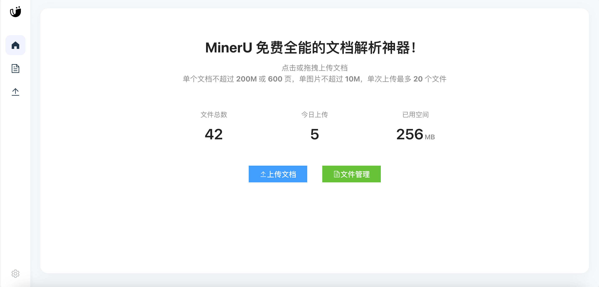
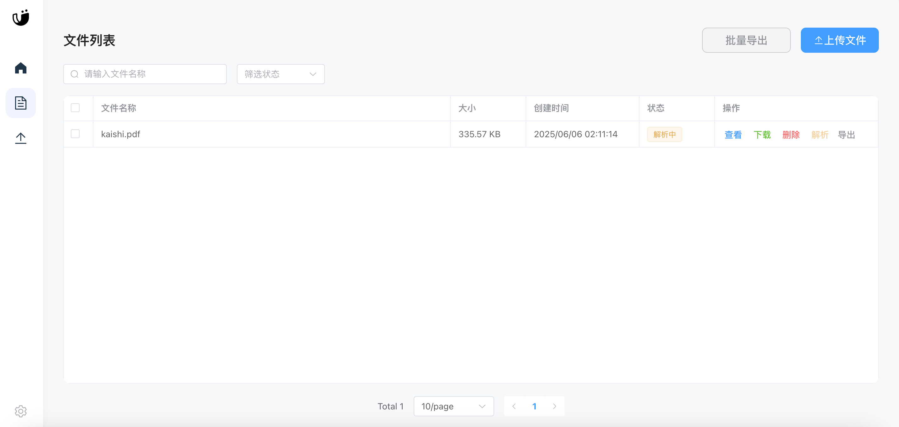
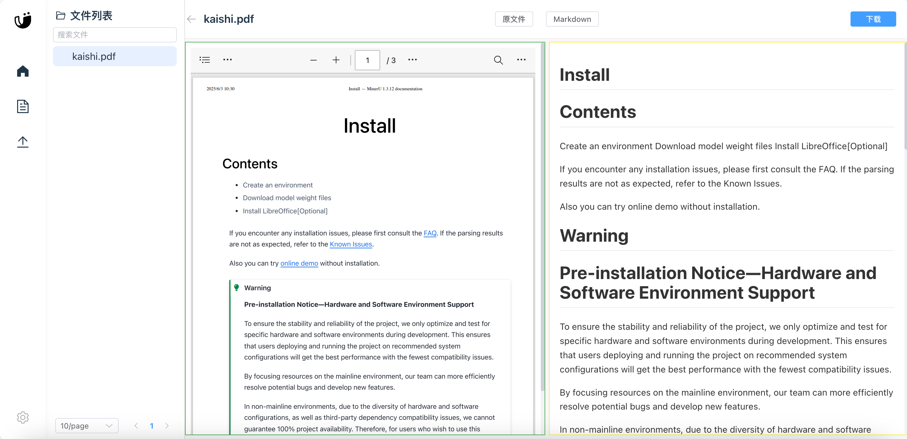

# MinerU Web

<div align="center">
  
  
  
  
</div>

## 🌟 项目简介

MinerU Web 是一个现代化的文档智能处理平台，基于先进的 AI 技术，提供文档解析、信息提取和智能分析功能。本项目采用前后端分离架构，结合容器化技术，为用户提供高效、可靠的文档处理解决方案。

## ✨ 核心特性

- 🚀 **高性能架构**：基于 FastAPI 和 Vue 3 构建，提供卓越的性能和用户体验
- 🤖 **AI 驱动**：集成先进的 AI 模型，实现智能文档解析和信息提取
- 📊 **多格式支持**：支持 PDF、Word、Excel 等多种文档格式的处理
- 🔄 **异步处理**：采用异步任务队列，支持大规模文档并发处理
- 🛡️ **安全可靠**：完善的权限控制和数据加密机制
- 🐳 **容器化部署**：提供完整的 Docker 支持，一键部署
- 🌐 **跨平台**：支持多种硬件架构，包括 x86_64 和 ARM64

## 🛠️ 技术栈

### 后端
- FastAPI：高性能异步 Web 框架
- Redis：分布式缓存和任务队列
- MinIO：高性能对象存储
- SQLite：轻量级数据库
- Docker：容器化部署

### 前端
- Vue 3：渐进式 JavaScript 框架
- Element Plus：企业级 UI 组件库
- TypeScript：类型安全的 JavaScript 超集
- Vite：下一代前端构建工具

## 🚀 快速开始

### 前置准备

1. 下载模型文件：
```bash
# 克隆项目
git clone https://github.com/lpdswing/mineru-web.git
cd mineru-web

# 下载模型文件
python download_models.py
```

2. 配置 MinIO 地址：
```bash
# 复制环境变量模板
cp .env.example .env

# 编辑 .env 文件，修改 MinIO 地址
MINIO_ENDPOINT=your-minio-address:9000
```

3. 配置magic-pdf.json

```bash
# 复制magic-pdf配置文件模板
cp magic-pdf.example.json magic-pdf.json

# 修改endpoint
    "bucket_info": {
        "mds": [
            "minioadmin",
            "minioadmin",
            "http://your-minio-address:9000"
        ]
    },
    "device-mode": "cpu", # 默认cpu，有显卡改为cuda

```

### 使用 Docker Compose 部署

```bash
# 启动服务
docker-compose up -d

# 参考以下网址安装mc
https://min.io/docs/minio/linux/reference/minio-mc.html

# 添加minio的alias
mc alias set local http://localhost:9000 minioadmin minioadmin

# 设置mds桶为public
mc anonymous set download local/mds

```


### 界面展示

<div align="center">
  
  <p>首页 - 展示系统概览和快速操作</p>
  
  
  <p>文件管理 - 支持多种文档格式的上传和管理</p>
  
  
  <p>文档预览 - 智能解析和展示文档内容</p>
  
  
  <p>文件上次 - 批量上传</p>
</div>

### 本地开发环境

```bash
# 启动本地开发环境
docker-compose -f docker-compose.local.yml up -d
```

## 📦 项目结构

```
mineru-web/
├── backend/           # 后端服务
│   ├── app/          # 应用代码
│   ├── tests/        # 测试用例
│   └── Dockerfile    # 后端 Docker 配置
├── frontend/         # 前端应用
│   ├── src/         # 源代码
│   ├── public/      # 静态资源
│   └── Dockerfile   # 前端 Docker 配置
├── models/          # AI 模型文件
├── magic-pdf.json   # 模型配置文件
├── docker-compose.yml           # 生产环境配置
├── docker-compose.local.yml     # 开发环境配置
└── README.md        # 项目文档
```

## 🔧 配置说明

### 环境变量

- `REDIS_HOST`：Redis 服务器地址
- `MINIO_ENDPOINT`：MinIO 服务器地址
- `DATABASE_URL`：数据库连接 URL

### 端口说明

- 8088：Web 界面
- 8000：后端 API
- 9000：MinIO API
- 9001：MinIO 控制台
- 6379：Redis

## 🤝 贡献指南

我们欢迎各种形式的贡献，包括但不限于：

- 提交问题和建议
- 提交代码改进
- 改进文档
- 分享使用经验

## 📄 开源协议

本项目采用 AGPL-3.0 协议开源，详情请参见 [LICENSE](LICENSE) 文件。

## 🌟 致谢

- [Mineru](https://github.com/opendatalab/MinerU)
- [fastapi](https://github.com/fastapi/fastapi)
- [vue3](https://github.com/vuejs/core)
---


## 📈 Star 趋势

[](https://www.star-history.com/#lpdswing/mineru-web&Date)
